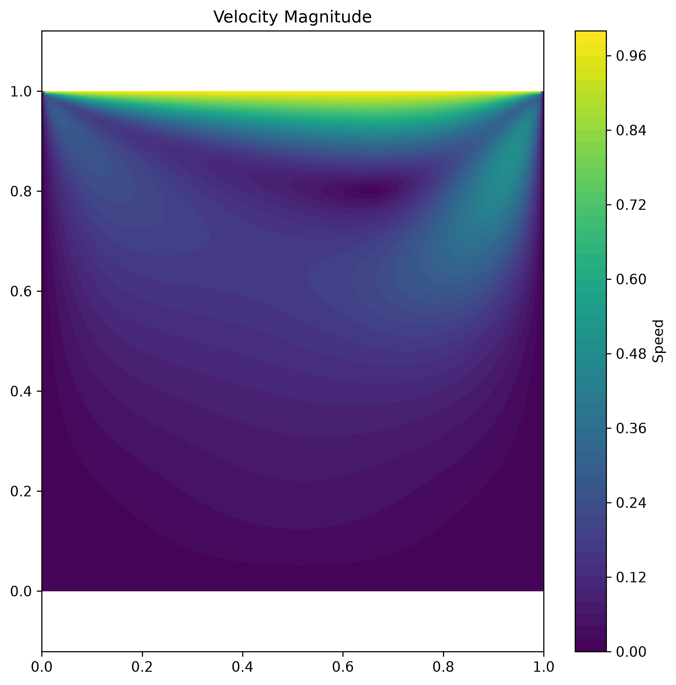
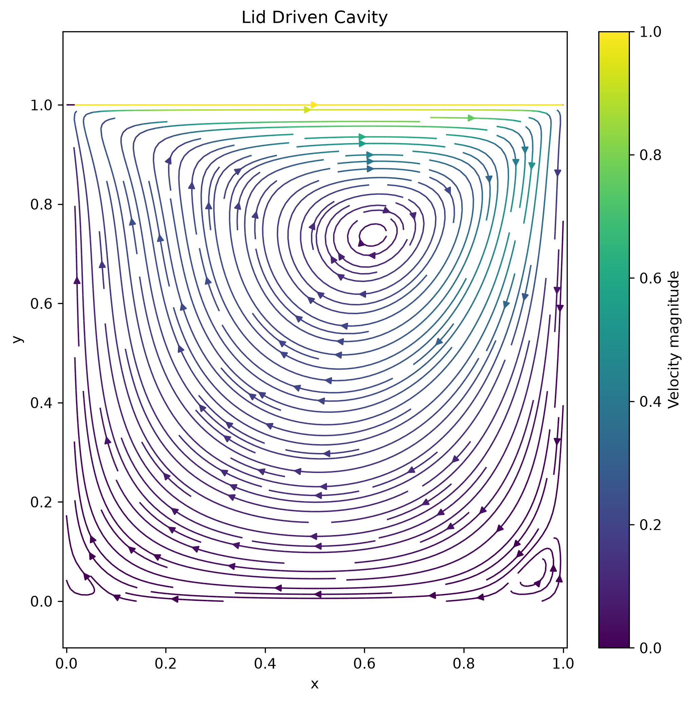
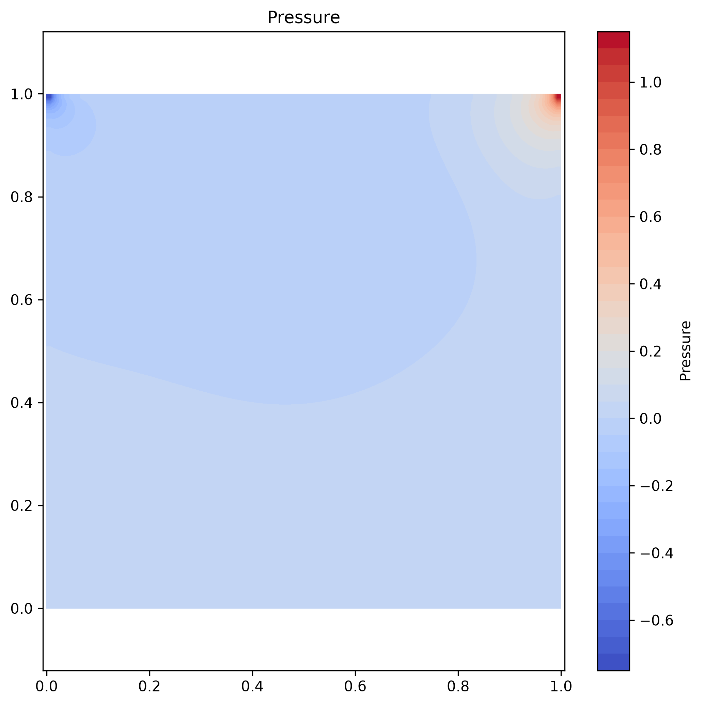
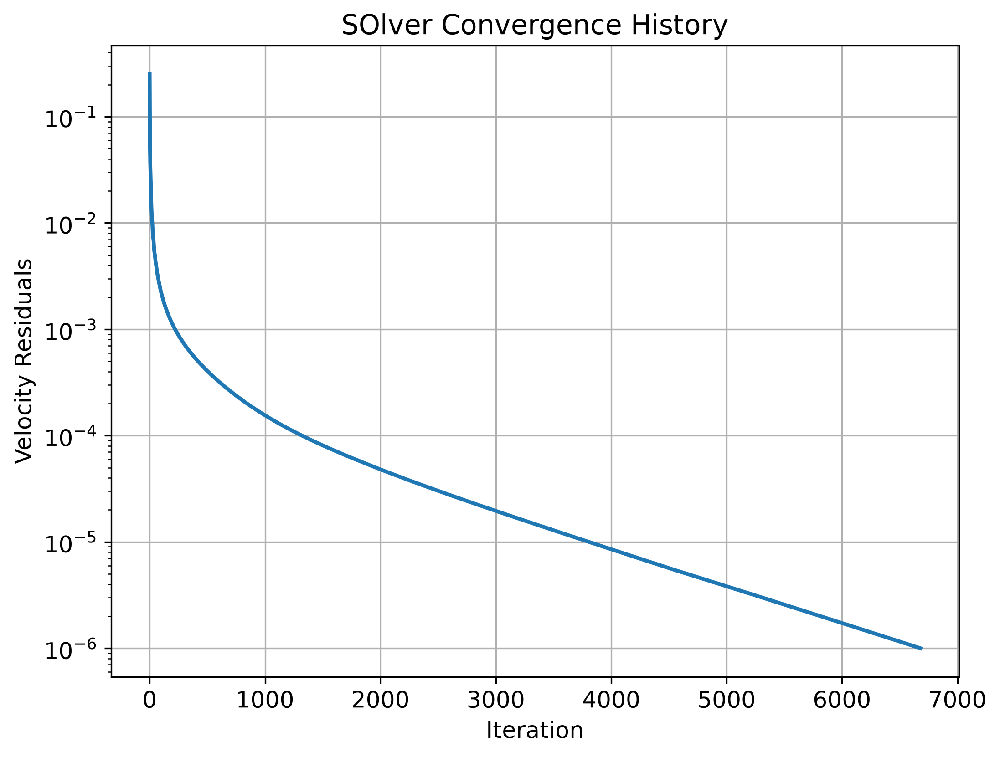
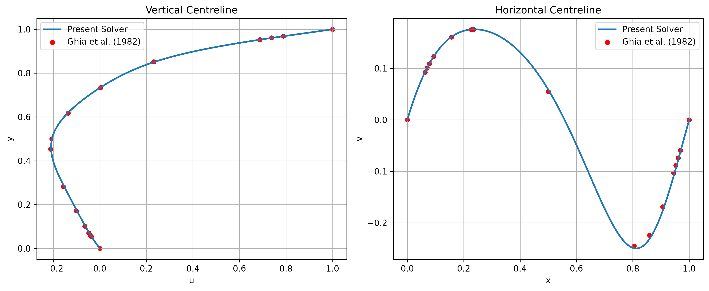

# Lid-Driven Cavity Flow Solver in C++

<p align="center">
  
  
  
  
</p>

A modern **C++17** implementation of the classical **2D incompressible lid-driven cavity flow** benchmark using the **Finite Difference Method (FDM)** and the **Pressure Projection Method**.

This project was developed after completing the **CFDPython – 12 Steps to Navier–Stokes** course as a way of translating the numerical algorithms into a modular C++ codebase while following modern software engineering practices. The repository serves as a foundation for future high-performance CFD implementations using OpenMP, MPI, CUDA, and more advanced numerical methods.

---

# Solver Overview

The lid-driven cavity problem is one of the most widely used benchmark problems in Computational Fluid Dynamics (CFD). A square cavity is filled with incompressible fluid where the top wall moves at a constant velocity while the remaining walls remain stationary. The resulting recirculating flow provides an excellent validation case for incompressible Navier–Stokes solvers.

Current implementation includes:

- ✅ C++17 implementation
- ✅ Finite Difference Method (FDM)
- ✅ Incompressible Navier–Stokes Equations
- ✅ Pressure Projection Method
- ✅ Gauss-Seidel Pressure Poisson Solver
- ✅ Structured Cartesian Grid
- ✅ Explicit Time Integration
- ✅ No-slip Wall Boundary Conditions
- ✅ Adaptive Time Step Calculation
- ✅ CSV Output
- ✅ Python Visualization Scripts
- ✅ Automated Verification Scripts
- ✅ Ghia et al. (1982) Validation

---

# Numerical Algorithm

For each iteration the solver performs

1. Compute intermediate velocities
2. Assemble the Pressure Poisson Equation
3. Solve pressure using Gauss-Seidel iteration
4. Remove mean pressure to eliminate pressure null-space drift
5. Correct the velocity field
6. Apply boundary conditions
7. Compute residuals
8. Repeat until convergence

A detailed explanation is provided in **docs/METHODOLOGY.md**.

---

# Results

## Velocity Magnitude

<p align="center">

</p>

---

## Streamlines

<p align="center">

</p>

---

## Pressure Contours

<p align="center">

</p>

---

## Residual History

<p align="center">

</p>

---

# Validation

The numerical solution is validated against the classical benchmark

> **Ghia, Ghia & Shin (1982)**

using

- Horizontal velocity along the vertical centreline
- Vertical velocity along the horizontal centreline

## Ghia Validation

<p align="center">

</p>

---

# Automated Verification

The repository includes Python scripts for automatic verification of

- Boundary conditions
- Continuity (divergence)
- Residual history
- Pressure contours
- Velocity magnitude
- Streamlines
- Ghia benchmark comparison

Run all scripts

```bash
for file in scripts/*.py; do
    python "$file"
done
```

---

# Repository Structure

```text
lid-driven-cavity-cpp/
│
├── plots/
│   ├── velocity_plot.png
│   ├── streamline_plot.png
│   ├── pressure_plot.png
│   ├── residual_plot.png
│   └── ghia_validation.png
│
├── docs/
│   └── METHODOLOGY.md
│
├── results/
│   ├── velocity_u.csv
│   ├── velocity_v.csv
│   ├── pressure.csv
│   ├── velocity_magnitude.csv
|   ├── simulation_info.txt
│   ├── x.csv
│   ├── y.csv
│   └── residual_history.csv
│
├── scripts/
│   ├── compare_ghia.py
│   ├── plot_pressure.py
│   ├── common.py
│   ├── plot_velocity.py
│   ├── plot_streamlines.py
│   ├── plot_residual.py
│   ├── verify_bc.py
│   └── check_divergence.py
│
├── src/
│   ├── csv_writer.cpp
│   ├── csv_writer.h
│   ├── main.cpp
│   ├── matrix.h
│   ├── simulation.cpp
│   └── simulation.h
│
├── CMakeLists.txt
├── README.md
└── LICENSE
```

---

# Building

Clone the repository

```bash
git clone https://github.com/YOUR_USERNAME/lid-driven-cavity-cpp.git

cd lid-driven-cavity-cpp
```

Build

```bash
mkdir -p build
cd build

cmake ..
make -j

cd ..
```

Run

```bash
./LidDrivenCavity
```

---

# Requirements

### Solver

- C++17
- CMake

### Python

- Python 3
- NumPy
- Matplotlib

---

# Future Improvements

- Higher-order convection schemes
- Successive Over-Relaxation (SOR)
- Multigrid pressure solver
- Staggered grid formulation
- Adaptive mesh refinement
- OpenMP parallelization
- MPI implementation
- CUDA implementation
- VTK output for ParaView
- Multiple Reynolds number validation
- Grid independence studies
- Performance benchmarking

---

# References

1. Lorena A. Barba et al.

   **CFDPython: 12 Steps to Navier–Stokes**

2. Ghia, U., Ghia, K. N., & Shin, C. T.

   *High-Re solutions for incompressible flow using the Navier–Stokes equations and a multigrid method.*

   Journal of Computational Physics, 48(3), 387–411.

3. Ferziger, J. H., & Perić, M.

   *Computational Methods for Fluid Dynamics.*

---

# Acknowledgements

This project was inspired by the **CFDPython – 12 Steps to Navier–Stokes** educational course developed by **Professor Lorena A. Barba** and collaborators.

While the numerical formulation follows the concepts introduced in that course, the C++ implementation, software architecture, validation workflow, visualization tools, documentation, and future development roadmap were independently designed and implemented as part of my Computational Fluid Dynamics learning journey.

---

# License

Released under the **MIT License**.